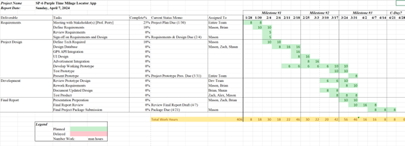

[Back](./)

## Project Plan

## Overview: 
All businesses require records of their mileage and time spent anytime they travel to an offsite location. With our Milage/Location Tracking mobile app any employee will have the ability to track the miles they travel for business record purposes.  

Our app will allow the user to have their starting and ending location tracked as well as the distance they travel. Thus, they will be able to accurately record their mileage as well as hours. Additionally, the app will create easily digested reports weekly. We conclude that this mobile app will be used by small business employees and owners for the sake of keeping records regarding mileage. 

Mobile app Mileage/Location Tracking app development using React Native, JavaScript and Firebase. 

React Native is an open-source UI software framework created by Meta Platforms, Inc. It allows the development of iOS/Android apps and uses JavaScript as the programming language. React Native also allows the UI of the IOS and Android apps to be platform specific allowing for a native feel to the app on each platform. JavaScript is an Open-Source, client-side programming language. It is easy to learn, stable, and creates high-performance applications. Firebase is a set of backend cloud computing services and application development platforms provided by Google. It hosts databases, services, authentication, and integration for a variety of applications, including Android, iOS, and JavaScript.  

## Final Deliverables: 
* Design a Database using Firebase 
* Integrate a GPS API for tracking starting and ending locations 
* Design a functional and readable User Interface 
* Monetize the App through an advertisement system 
* Present Prototype 
* Create a Final Report for the Project 

## Milestone Events: 
1. All Requirements Reviewed - By February 4th  
2. Complete Semi-Functional Prototype - By March 17th  
3. Finalize Prototype - By March 31st  
4. Review Final App and Report – By April 10th  
5. Finalize Project Package – By April 21st  

## Meeting Schedule Date/Time: 
Weekly Meetings on Tuesdays at 7:30 PM 

## Collaboration and Communication Plan: 
Communication 	— 	Teams, Cellphones (Call/Text) 
Collaboration     	—	Discord 

## Project Schedule and Task Planning: 

## Version Control Plan: 
We will be using GitHub as our main source of version control.  The group GitHub can be found here: 
<a href="{{ site.github.owner_url }}">

[Back](./)
